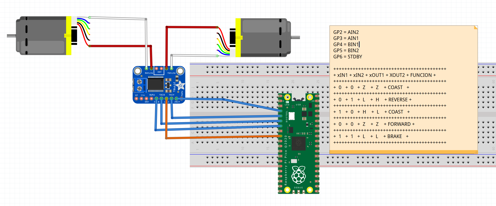

# Some ROS2 with raspberry pico, nvidia Jetson AGX and other stuff
## Introduction

This repository includes my first try to integrate raspberry pico as a motor driver and integrate with ROS2 in a basic setup for a 2WD/4WD autonomous car

## Technologies

### Hardware

- Raspberry pico (1)
- Motor Driver DRV8833 (1 or 2)
- DC Motors with hall encoder (2 or 4)
- Jetson Nano (1) or Jetson AGX (1)

### Software

- C++
- Python 3.8.10
- Ubuntu 20.04
- ROS 2 Foxy
- Jetpack 5.0.1 Developer Preview
- VSC 

## Setup

This is only for checking motor integration. No encoder input at this time.

## Status

At this state I'm testing raspberry pico before integrating as a ros2 node to move motors and collect telemetry

## Me

I'm Juan Ramirez Jardua, electrical engineer. My main function is to implement and support GxP systems in the pharmaceutical industry, but in my free time I enjoy with robotics, photography, cats and other hobbies.

If you like photography as I do, you can visit me at [@juanramirezj]

[//]: # (Links)

[@juanramirezj]: <https://www.instagram.com/juanramirezj/>

